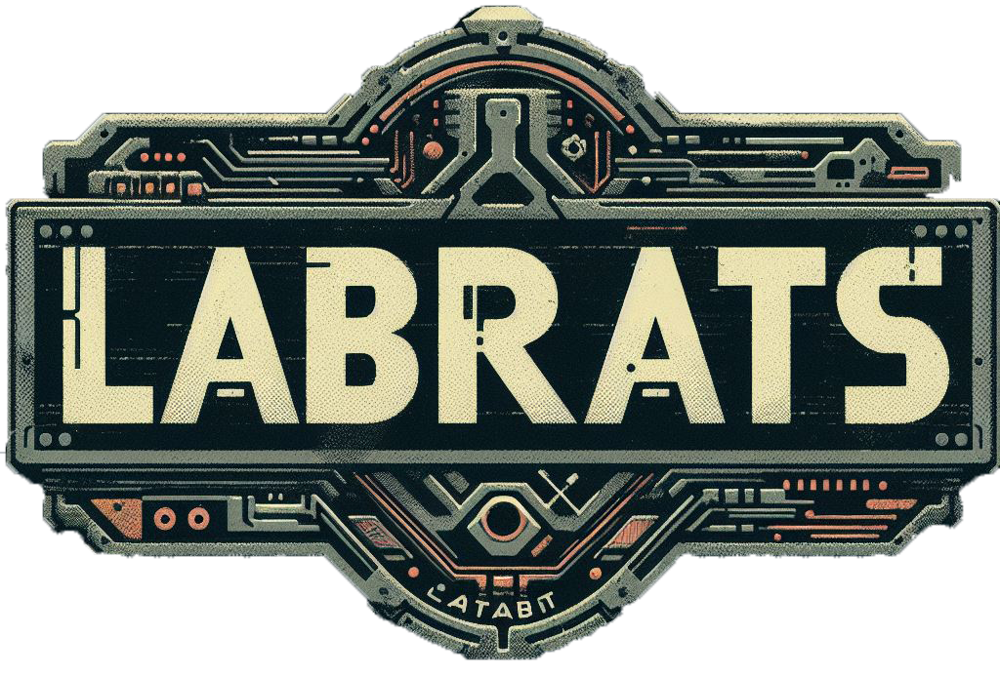



  

---

## A játék működése

### PC:
A program futtatásához csupán a [Releases](https://github.com/Edemfancypants/LabRats/releases) oldalon megtalálható .zip állomány kicsomagolása, majd a játék könyvtárában található .exe fájl megnyitása szükséges.

### Vita: 
TBD

---

## Technikai Specifikációk

### A Projekt buildeléséhez szükséges eszközök

Unity Engine: 2018.2.19f1

### A játék által kezelt könyvtár

A program a játék adatainak mentéséhez és betöltéséhez XML-típusú adat szerializálást használ, a kezelt adatokat egy .save kiterjesztésű fájl tartalmazza.

A mentéseket tároló mappának az elérési útját az Application.PersistentDataPath() method adja meg, ami a felhasználó által a ==C:\Users\userXY\AppData\LocalLow\EdemFancypants\LabRats== elérési úton található meg.

### Felhasznált assetek

A projekt repository-ja nem tartalmazza ezeket az asseteket tárhely korlátozások, és felhasználási szabályozások miatt, így ezeket a felhasználónak magától kell importálnia. (amennyiben fel szeretné használni a projektben megtalálható pályákat.)

- Sci-fi laboratory - modular interior and props: https://assetstore.unity.com/packages/3d/environments/sci-fi/sci-fi-laboratory-modular-interior-and-props-127564
- Sci-fi Laboratory Pack 2: https://assetstore.unity.com/packages/3d/environments/sci-fi/sci-fi-laboratory-pack-2-35688
- Sci-fi Laboratory Props: https://assetstore.unity.com/packages/3d/props/sci-fi-laboratory-props-36889
- Abandoned Factory Scene: https://assetstore.unity.com/packages/3d/environments/industrial/abandoned-factory-scene-83392
